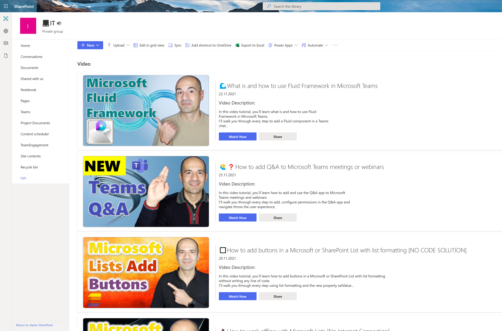

# 📽️How to create a video library view with List Formatting in SharePoint
This sample demonstrate how to use list view formatting to set a video library view in a SharePoint document library

## Requirements
The following columns have to be created in the SharePoint document library:

- **VideoDescrition**: Multiline text (no rich html field) column
- **Date**: Date and Time column
- **Thumbnail**: Image column
- **Availability**: Calculated column that displays the buttons

📺check my YouTube Video tutorial to follow a step-by-step guide:
https://youtu.be/pP8DcE-V8uA

🔗Microsoft article about List Formatting:
https://docs.microsoft.com/en-us/sharepoint/dev/declarative-customization/column-formatting